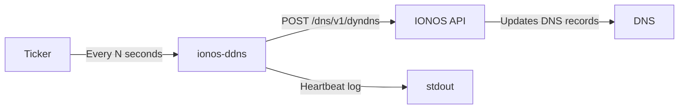

# IONOS DynDNS Updater

[](https://github.com/a-belhadj/ionos-ddns/actions/workflows/ci.yml)
[](https://github.com/a-belhadj/ionos-ddns/actions/workflows/docker-publish.yml)
[](https://goreportcard.com/report/github.com/a-belhadj/ionos-ddns)
[](https://github.com/a-belhadj/ionos-ddns/pkgs/container/ionos-ddns)
[](https://www.gnu.org/licenses/gpl-3.0)

Automatically update your IONOS DNS records with your current public IP address.

The service periodically sends POST requests to `https://api.hosting.ionos.com/dns/v1/dyndns` to update your domain records. See the [IONOS DynDNS API documentation](https://developer.hosting.ionos.com/docs/dns) for details.

## How it works



The service runs as a lightweight container and periodically calls the IONOS DynDNS API to keep your DNS records pointing to your current public IP. It uses structured logging with configurable verbosity and a heartbeat mechanism to confirm the service is running without flooding the logs.

## Quick Start

```bash
# Configure
cp .env.example .env
nano .env

# Run with Podman Compose
make up

# Or run locally
make run
```

## Configuration

Configure via `.env` file:

```bash
IONOS_API_KEY=prefix_public.secret         # Required: Your IONOS API key
IONOS_DOMAINS=example.com,sub.example.com  # Required: Domains to update
UPDATE_INTERVAL_SECONDS=300                # Optional: Update interval in seconds (default: 300)
LOG_LEVEL=INFO                             # Optional: DEBUG, INFO, WARN, ERROR (default: INFO)
HEARTBEAT_INTERVAL_SECONDS=21600           # Optional: Heartbeat log interval in seconds (default: 21600 = 6h)
```

## Building

```bash
make run      # Run locally
make build    # Build binary
make up       # Start with podman-compose
make down     # Stop with podman-compose
make status   # Show container status
make logs     # Follow container logs
```

## API

Uses the [IONOS DynDNS API](https://developer.hosting.ionos.com/docs/dns#tag/Dynamic-DNS).
