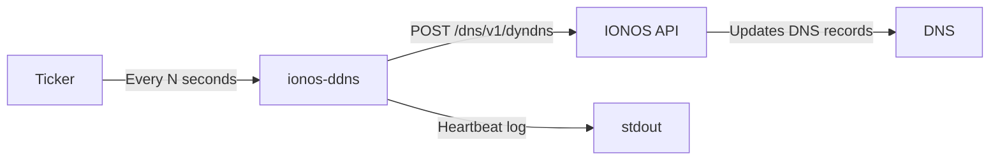

# IONOS DynDNS Updater

[](https://github.com/a-belhadj/ionos-ddns/actions/workflows/ci.yml)
[](https://github.com/a-belhadj/ionos-ddns/pkgs/container/ionos-ddns)
[](https://www.gnu.org/licenses/agpl-3.0)

A lightweight Go service that automatically keeps your IONOS DNS records pointing to your current public IP address. Zero external dependencies, minimal container image, built for self-hosters.

## Features

- **Lightweight** — Built with Go, zero external dependencies, runs from a `scratch` Docker image
- **Multi-arch** — Supports `amd64` and `arm64` (Raspberry Pi, Apple Silicon)
- **Kubernetes ready** — Includes manifests with Kustomize, health checks, and security hardening
- **Structured logging** — Uses `log/slog` with configurable log levels and heartbeat monitoring
- **Health endpoint** — Built-in `/healthz` endpoint for liveness and readiness probes
- **CI/CD** — Automated testing, linting, Docker builds, vulnerability scanning, and releases

## Quick Start

```bash
# 1. Configure
cp .env.example .env
nano .env

# 2. Run
make up
```

That's it. The service will start updating your DNS records every 5 minutes.

## How it works

The service periodically sends a POST request to the [IONOS DynDNS API](https://developer.hosting.ionos.com/docs/dns) to update your domain records with your current public IP.


